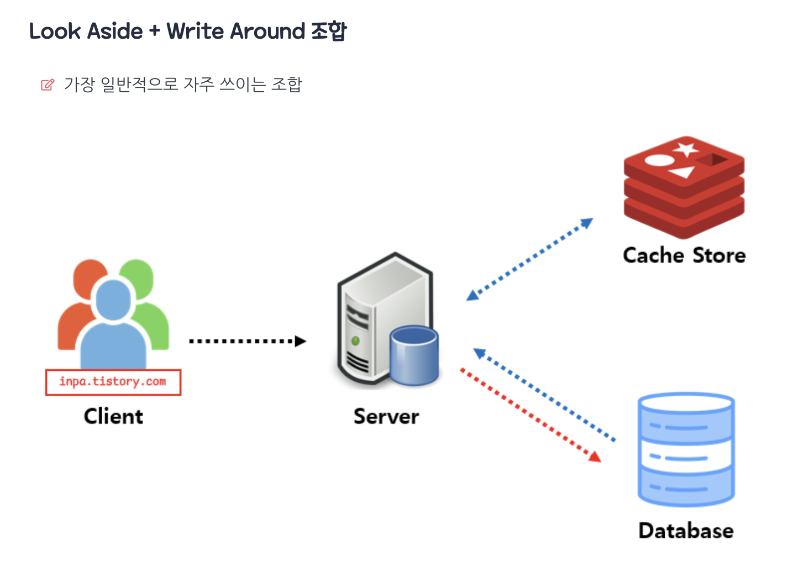
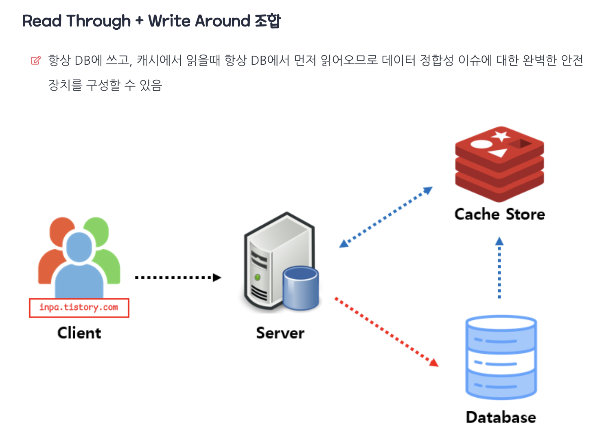
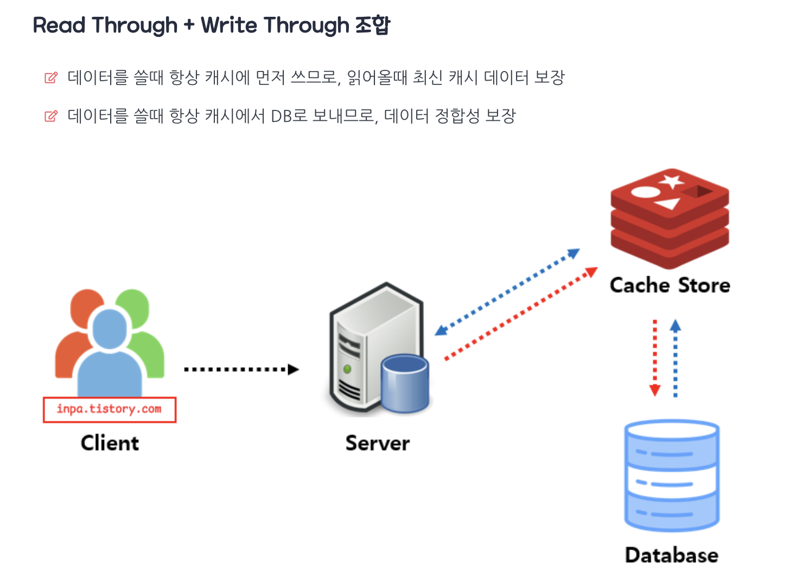
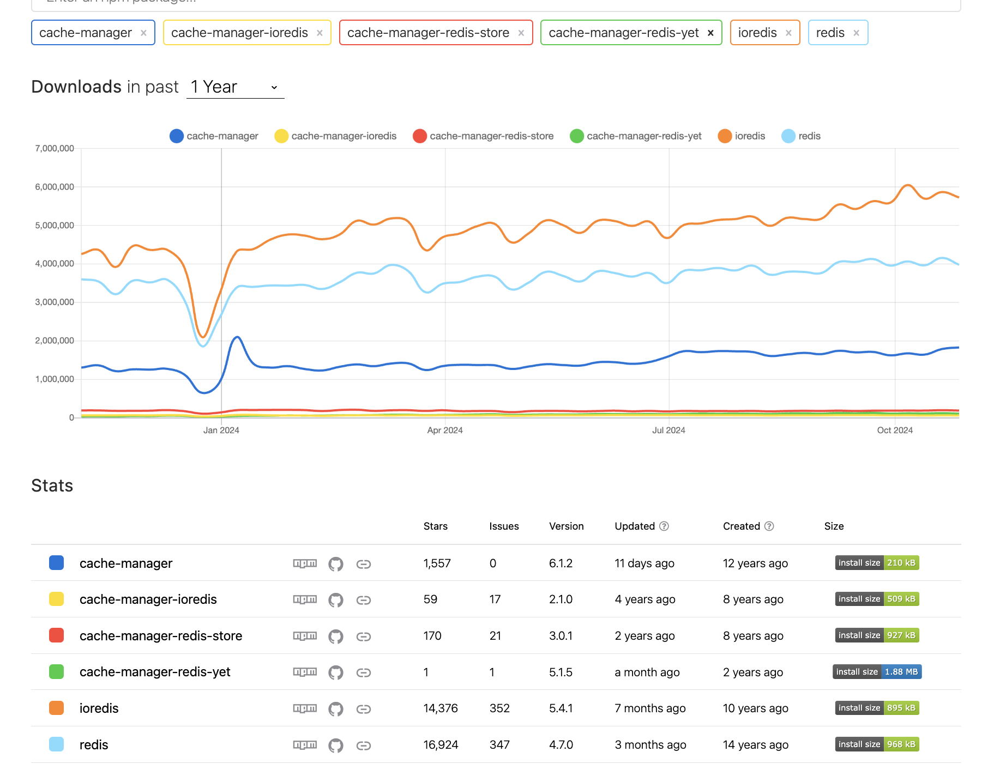

# ✅ 캐시 전략 분석 보고서

## 1. 캐시 전략

| 구분 | 전략 | 동작 방식 | 장점 | 단점 | 적합한 사용 사례 |
|------|------|-----------|------|------|-----------------|
| 읽기 | Look Aside | 캐시 먼저 확인 후 없으면 DB 조회 | • 실제 사용 데이터만 캐싱 • 캐시 장애 시 DB로 대체 가능 | • 초기 응답 지연 • 데이터 정합성 이슈 | • 소셜 미디어 피드 • 상품 카탈로그 |
| 읽기 | Read Through | 캐시를 통해서만 데이터 읽기 | • 데이터 동기화 자동화 • 일관된 데이터 접근 방식 | • 캐시 장애 시 서비스 중단 • 초기 데이터 로딩 필요 | • 반복적 읽기가 많은 서비스 • 데이터 일관성이 중요한 경우 |
| 쓰기 | Write Through | 캐시와 DB 동시 업데이트 | • 데이터 일관성 보장 • 안정적인 데이터 처리 | • 쓰기 지연 발생 • 리소스 사용량 증가 | • 금융 거래 시스템 • 실시간 재고 관리 |
| 쓰기 | Write Back | 캐시에 먼저 쓰고 후에 DB 반영 | • DB 부하 감소 • 빠른 쓰기 응답 | • 데이터 유실 위험 • 정합성 보장 어려움 | • 로그 시스템 • 조회수 카운터 |
| 쓰기 | Write Around | DB에만 쓰고 캐시는 읽기 시 갱신 | • 불필요한 캐시 데이터 방지 • 빠른 쓰기 처리 | • 캐시 미스 증가 • 읽기 성능 저하 | • 로그 데이터 • 일회성 데이터 처리 |

## 2. 전략 조합 활용 사례

### 2.1. Look Aside + Write Around

- **활용 시나리오**: 소셜 미디어 플랫폼
- **구현 방식**: 
  - 게시물 읽기: Look Aside로 캐시 우선 확인
  - 게시물 작성: Write Around로 DB 직접 저장
- **장점**: 자주 조회되는 콘텐츠만 캐시에 유지되어 효율적

### 2.2. Read Through + Write Through

- **활용 시나리오**: 전자상거래 플랫폼
- **구현 방식**:
  - 상품 조회: Read Through로 일관된 데이터 제공
  - 재고 업데이트: Write Through로 즉시 동기화
- **장점**: 데이터 정합성이 중요한 비즈니스 로직에 적합

### 2.3. Read Through + Write Through 조합

- **활용 시나리오**: 금융 거래 시스템, 재고 관리, 예약 시스템
- **구현 방식**:
  - 읽기: 캐시 계층이 DB 조회 및 데이터 동기화 담당
  - 쓰기: 캐시와 DB 동시 업데이트로 강한 정합성 보장
- **장점**:
  - 데이터 정합성 보장
  - 일관된 데이터 접근 패턴
  - 캐시 계층에서 데이터 관리 로직 통합

## 3. 콘서트 서비스(예약 서비스)에는 어떤 전략이 좋을까?

이번 챕터는 학습하고 적용하기에 바쁜 한주였습니다. 그렇기 때문에 가설만 내렸을 뿐 실질적인 테스트는 진행하지 못 했습니다.

캐시를 어디에 적용할까 보다 먼저 든 생각은 지금 만들고 있는 콘서트 서비스 즉, 예약 서비스는 실제 존재한다면 어떤 서비스가 되어야 할지 부터 고민했습니다. 

그래서 페르소나 부터 지정을 해보았습니다. 
1. 인터파크 티켓(대형 공연 예약)
2. 케치테이블(식당 예약)
3. 디트릭스(독립영화관 예약)

> [!NOTE] 💡 인터파크 티켓이라면?
> 분류: 콘서트 > 공연 > 좌석 분류  
> 특징: 소분류인 좌석이 수백 ~ 수만개 까지 다양하다.

> [!NOTE] 💡 케치테이블이라면?
> 분류: 식당 > 일자 > 좌석  
> 특징: 대분류인 식당 자체가 많다.

> [!NOTE] 💡 디트릭스라면?
> 분류: 영화 > 일자 > 좌석  
> 특징: 대 중 소 분류 모두 소규모이다.

모두 Redis로 캐시를 한다면 의미가 있을 것이라고 생각됩니다. 
여기서 가설이긴 하지만 1번과 3번의 경우는 복잡하지 않은 구조 또는 읽기 전용 DB 성능으로도 어느정도 커버가 될것이라고 생각됩니다. 반면 "케치테이블"의 데이터를 분석(CSR이며 API 데이터 분석 가능)해본 결과 데이터 베이스 자체가 압도적으로 컷습니다. 게다가 위치에 따라 시시각각 변하기 떄문에 캐시를 적용하기 가장 적합하다고 생각됩니다.

## 4. 어떤 전략을 사용해야 할까?

조사해본 결과 전략은 공식처럼 나와 있는 경우가 많았습니다.
- 읽기 빈도가 높은 데이터 → Look Aside
- 쓰기 빈도가 높은 데이터 → Write Back
- 정합성이 중요한 데이터 → Write Through

여기서 제 생각은 조금 다릅니다. 
참고할 만한 공식이 있다는 것은 좋지만, 정량적이지 못하다고 생각되기 때문입니다.
서비스의 특징적인 것도 있겠지만 트래픽과 인프라 비용을 무시할 수 없다고 생각하기 때문입니다.

## 5. 테스트를 수행한다면 어떤 점을 고려해야 하나?
### 5.1. 성능 지표
- 응답 시간 (Response Time)
- 처리량 (Throughput)
- 리소스 사용률 (Resource Utilization)
- 데이터 정합성 (Data Consistency)

### 5.2. 주요 고려사항
- **메모리 관리**
  - 캐시 크기 제한 (보통 16~32GB)
  - 캐시 교체 정책 (LRU, LFU 등)
  - 메모리 단편화 관리

- **데이터 정합성**
  - TTL(Time To Live) 설정
  - 캐시 무효화 전략
  - 동시성 제어

- **장애 대응**
  - 캐시 서버 이중화
  - 폴백(Fallback) 메커니즘
  - 서킷 브레이커 패턴

## 6. 레디스 캐시 구현과 적용

### 6.1. nestjs(nodejs) 생태에서 캐시 사용의 한계

nestjs는 프레임 워크입니다 그렇기 때문에 캐시 사용을 위한 공식 라이브러리를 제공해 줍니다.
하지만 사용하는 방식이 클래스에 인스턴스를 직접 의존해 사용해야합니다. 물론 AOP 방식도 제공을 하기는 하지만, Controller에 부여 해야하는 단점이 있습니다.

또한 캐시 모듈에 직접 사용되는 Redis 구현체 중구난방입니다. 실제 소개하는 글마다 다른 라이브러리를 사용합니다.

이러한 이유로 `@Cache` 데코레이터와 `ioredis`를 사용하는 `CacheStore`를 직접 구현해 사용했습니다.

- [적용과정을 정리한 PR](https://github.com/dbwogus94/hhplus-concert-ticketing-service/pull/45)

### 캐시 적용

현재 2 곳에 캐시를 붙인 상태입니다. 
1. 공연 리스트 조회
2. 공연의 좌석 리스트 조회 

콘서트 시나리오의 경우 캐시를 붙일 곳이 많지는 않습니다. 그렇기 때문에 이후 콘서트 API를 만들고, 추가로 서비스의 페르소나 자체를 캐치테이블과 비슷하게 가져가서 데이터를 넣고 테스트를 가져볼 계획을 하고 있습니다.

## 3. Redis를 사용한 대기열 개선 보고서

대기열 개선은 발제에 소개된 방법을 베이스로 가져갔습니다.
처음부터 발제에 소개된 방법을 가져오지는 않았습니다. 더 정확히는 선택지 자체에도 없었습니다.
여러 방법을 고민해 봤고, 그것들과 비교 했을때 요구사항에 맞게 자료구조를 적절하게 사용한 발제의 방법이 가장 이상적이였습니다.

가장 크게 고민한 것은 2가지 였습니다.
1. Redis 자체에서 제공하는 자료형을 최대한 이용할 것인가?
2. Redis에 자료형 보단 Redis를 사용해서 Queue를 구현해볼 것인가?

처음에는 2번 방법인 Queue를 구현하는 방식을 고려했습니다. 이 방법은 프레임워크 자체에서 제공하는 기능을 최대한 활용해 모든 로직이 코드에서 관리되게 할 수 있기 때문입니다.
하지만 설게 과정에서 몇가지 문제점을 알게 되었고 다시 생각했습니다. 

대기열이 왜 필요할까? 대기열은 트래픽의 가장 첫 관문입니다. 대기열을 통해 시스템이 보호 될 수 있습니다. Queue를 구현은 투명하지만 대기열 증가에 비례해 더 많은 메모리를 사용하는 문제와 Redis의 컴퓨팅 파워를 거의 이용하지 못합니다. 가장 큰 단점은 TTL 기능과 다양한 자료형 자체를 사용하지 못하도록 추상화가 되어 있었습니다. 

### Redis를 사용해 개선된 로직 시퀀스 다이어그램

``` mermaid

sequenceDiagram
    participant User as 👤 User
    participant API as 🔧 API
    participant Redis as 📦 Redis

    rect rgb(70, 90, 120)
        Note over User,Redis: 대기열 등록 프로세스
        User->>+API: 대기열 등록 요청
        API->>API: UUID 생성
        API->>Redis: ZADD waiting:queue score {token, userId}<br/>✨ Sorted Set에 score 기준으로 저장
        API->>Redis: HSET queue:info:token {...추가정보}<br/>📝 Hash 구조로 추가 정보 저장
        API-->>-User: UUID 반환
    end

    rect rgb(70, 120, 90)
        Note over API,Redis: N분마다 M명 활성화 (Scheduler)
        API->>Redis: ZRANGE waiting:queue 0 M-1<br/>📑 처음부터 M명 조회
        loop 각 멤버에 대해
            API->>Redis: SET active:users:token {...정보}<br/>✅ 활성 상태로 전환
            API->>Redis: ZREM waiting:queue member<br/>❌ 대기열에서 제거
        end
    end

    rect rgb(120, 70, 70)
        Note over User,Redis: 상태 확인 (5초마다)
        User->>API: 상태 확인 요청 (token)
        API->>Redis: GET active:users:token<br/>🔍 활성 상태 확인
        alt 활성 상태
            Redis-->>API: 활성 상태 정보
            API-->>User: ✨ 서비스 이용 가능
        else 대기 상태
            API->>Redis: ZRANK waiting:queue token<br/>🔢 대기열 순위 조회
            Redis-->>API: 대기 순위
            API-->>User: ⏳ 대기 상태 + 순위
        end
    end

    rect rgb(120, 120, 70)
        Note over User,Redis: 활성 토큰 최초 사용
        User->>API: 서비스 요청 (token)
        API->>Redis: GET active:users:token<br/>🔍 활성 상태 확인
        API->>Redis: DEL active:users:token<br/>🗑️ 기존 키 삭제
        API->>Redis: SETEX active:users:token 300 {...정보}<br/>⏰ 5분 TTL 설정
        API-->>User: 서비스 응답
    end
```

라이트모드 전용

``` mermaid

sequenceDiagram
    participant User
    participant API
    participant Redis

    rect rgb(200, 220, 240)
        Note over User,Redis: 대기열 등록 프로세스
        User->>API: 대기열 등록 요청
        API->>API: UUID 생성
        API->>Redis: ZADD waiting:queue score {token, userId}<br/>(Sorted Set에 score로 정렬하여 저장)
        API->>Redis: HSET queue:info:token {...추가정보}<br/>(Hash 구조로 추가 정보 저장)
        API->>User: UUID 반환
    end

    rect rgb(220, 240, 200)
        Note over API,Redis: N분마다 M명 활성화 (Scheduler)
        API->>Redis: ZRANGE waiting:queue 0 M-1<br/>(Sorted Set에서 처음부터 M명 조회)
        loop 각 멤버에 대해
            API->>Redis: SET active:users:token {...정보}<br/>(활성 상태로 전환)
            API->>Redis: ZREM waiting:queue member<br/>(대기열에서 제거)
        end
    end

    rect rgb(240, 220, 220)
        Note over User,Redis: 상태 확인 (5초마다)
        User->>API: 상태 확인 요청 (token)
        API->>Redis: GET active:users:token<br/>(활성 상태 확인)
        alt 활성 상태
            Redis-->>API: 활성 상태 정보
            API-->>User: 서비스 이용 가능
        else 대기 상태
            API->>Redis: ZRANK waiting:queue token<br/>(대기열에서의 순위 조회)
            Redis-->>API: 대기 순위 (0부터 시작)
            API-->>User: 대기 상태 + 순위
        end
    end

    rect rgb(240, 240, 200)
        Note over User,Redis: 활성 토큰 최초 사용
        User->>API: 서비스 요청 (token)
        API->>Redis: GET active:users:token<br/>(활성 상태 확인)
        API->>Redis: DEL active:users:token<br/>(기존 키 삭제)
        API->>Redis: SETEX active:users:token 300 {...정보}<br/>(5분 TTL과 함께 재설정)
        API-->>User: 서비스 응답
    end
```

## 4. 추가 개선 가능한 지점

### 콘서트 기능적인 측면
1. 좌석 예약 만료 TTL 레디스 사용

### 장애대응 측면

1. 레디스 장애 조치를 위해 AOF, RDS 적용
  사용한다면 2가지 기능을 모두 사용하는 방법을 고려해 보고 있습니다. 
  공식문서를 통해 조사해 본 결과 RDS에는 일정 주기마다 스냅샷을 넣어 전체적인 데이터를 복구하고, 
  가장 최신 데이터는 AOF를 통해 복구하는 것이 가장 안전하다고 판단했기 때문입니다.

2. 레디스 클러스터링을 통한 가용성 증대
  
3. 서킷 브래이커를 통한 Redis 장애시 DB와 통신하도록 처리
  현재는 Look Aside 방식을 사용하기 때문에 어느 정도 대응이 될 것이라고 생각됩니다.